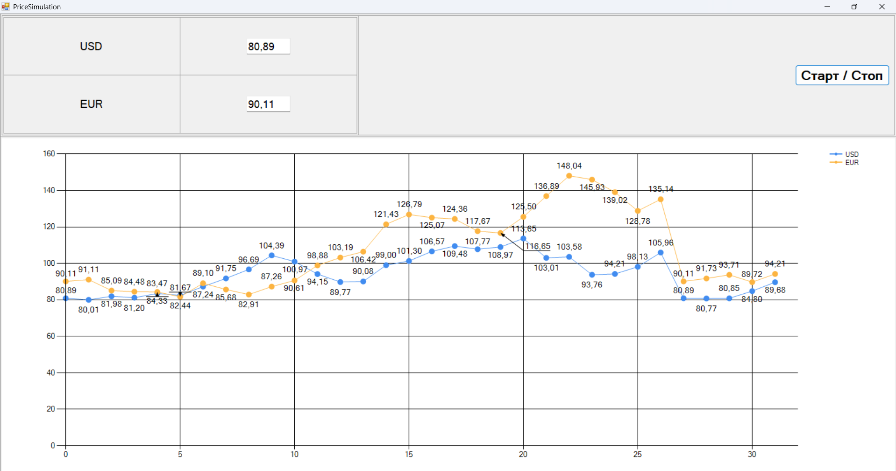

# 💹 PriceSimulation

Currency price simulation tool with two modeling approaches:  
1. **Simple random walk** (v1)  
2. **Geometric Brownian Motion** (v2, enhanced version)  

Симулятор изменения цен валют с двумя подходами моделирования:  
1. **Простое случайное блуждание** (v1)  
2. **Геометрическое броуновское движение** (v2, улучшенная версия)

---

## 📌 About / О проекте

🎓 Developed for a Simulation Modeling course.  
💡 Simulates daily price fluctuations for USD and EUR.  
📊 Real-time chart updates with labeled points.

🎓 Разработано в рамках курса по имитационному моделированию.  
💡 Моделирует ежедневные колебания цен для USD и EUR.  
📊 Отображает изменения на графике в реальном времени с подписями точек.

---

## 🔧 Features / Возможности

- 💱 Two currencies simulated in parallel (USD, EUR)  
  Две валюты моделируются параллельно (USD, EUR)

- 🖱 Start/Stop simulation  
  Кнопка запуска/остановки симуляции

- 📈 Real-time chart plotting with value labels  
  Построение графика в реальном времени с подписями значений

- 🛡 Input validation for initial prices  
  Проверка корректности ввода начальных цен

---

## 🔄 Evolution of the Project / Эволюция проекта

### **Version 1 — PriceSimulation**  
- 📐 Model: simple random walk with step factor `k = 0.03`  
- 🔢 Price update formula:
  \right))
- 🎯 Produces short-term, random oscillations without trend

- 📐 Модель: простое случайное блуждание с коэффициентом шага `k = 0.03`  
- 🔢 Формула обновления цены:  
  \right))  
- 🎯 Дает краткосрочные случайные колебания без выраженного тренда

### **Version 2 — PriceSimulationNewVersion**  
- 📐 Model: **Geometric Brownian Motion** (GBM)  
- 📊 Uses normally distributed random values (Box–Muller transform)  
- 🔢 Price update formula:
  \Delta%20t%20+%20\sigma%20\sqrt{\Delta%20t}%20\cdot%20\xi%20\right]) 
  where:  
  - μ = mean growth rate  
  - σ = volatility  
  - ξ = standard normal random variable  
- 🎯 Produces realistic financial price paths with volatility and drift

- 📐 Модель: **Геометрическое броуновское движение** (Geometric Brownian Motion, GBM)  
- 📊 Используются нормально распределенные случайные величины (метод Бокса–Мюллера)  
- 🔢 Формула обновления цены:  
  \Delta%20t%20+%20\sigma%20\sqrt{\Delta%20t}%20\cdot%20\xi%20\right])  
  где:  
  - μ — средний темп роста  
  - σ — волатильность  
  - ξ — нормально распределённая случайная величина с мат. ожиданием 0 и дисперсией 1  
- 🎯 Дает более реалистичную динамику цен с учетом дрейфа и волатильности

---

## 📁 Structure / Структура

- `/PriceSimulation/` — original version (simple random walk)  
Оригинальная версия (простое случайное блуждание)

- `/PriceSimulationNewVersion/` — updated version (GBM model)  
Обновлённая версия (модель геометрического броуновского движения)

---

## 🖼 Screenshots / Скриншоты

  
*Рис. 1 — Пример работы симулятора (простое случайное блуждание)*

  
*Рис. 2 — Пример работы симулятора (модель геометрического броуновского движения)*

